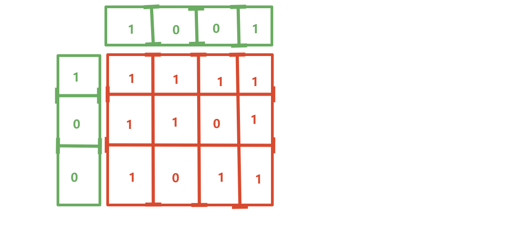

# 18. Set Matrix Zeroes

- **题目 : [73. 矩阵置零](https://leetcode.cn/problems/set-matrix-zeroes/)**

> 难度: 中等
>
> 标签: 数组, 哈希表, 矩阵

## 解法一

**思路:**

- 第一种很明显的解法就是

```java
// 创建一个新的矩阵来存放答案, 比如

[1, 1, 1]		[1, 0, 1]
[1, 0, 1]  -->  [0, 0, 0] //然后返回这个新的矩阵就行了
[1, 1, 1]		[1, 0, 1]
// 1. 先创一个新的矩阵
    // 新矩阵里面全是1,大小和原矩阵一样
// 2. 只需要遍历一遍这个矩阵, 如果有 0 把新矩阵对应的行列都变为 0 便可    
// 这种方法时间是O(mn) 空间也是O(mn)
```

- 第二种方法就是
- 我们可以不用创建一个新矩阵, 而是创建俩个数组, 长度分别为 m 和 n




如上图

- 这样一来, 时间不变,仍然是O(mn) , 但是空间变为了 O(m + n)

- 但是这样仍然还不是最优
- 那我们可不可以不创建这个额外数组呢?
- 当然可以

- 我们可以复用原始矩阵的第一行和第一列
- 不过要注意, 一定要先记录原本第一行第一列有无0 ,否则会被污染

**AC代码:**

```java
class Solution {
    public void setZeroes(int[][] matrix) {
        int m = matrix.length;
        int n = matrix[0].length;

        // 把第一行, 第一列当作参照
        // 所以要先记录第一行第一列是否有0
        boolean row0 = false;
        boolean col0 = false;
        for(int i = 0; i < m; i++) {
            if(matrix[i][0] == 0) {
                col0 = true;
                break;
            }
        }
        for(int i = 0; i < n; i++) {
            if(matrix[0][i] == 0) {
                row0 = true;
                break;
            }
        }
        // 从第二行第二列开始遍历, 也就是从matrix[1][1]开始
        // 如果有0, 则把对应的 第一行 和对应的 第一列 置为0
        for(int i = 1; i < m; i++) {
            for(int j = 1; j < n; j++) {
                if(matrix[i][j] == 0) {
                    matrix[i][0] = 0;
                    matrix[0][j] = 0;
                }
            }
        }
        // 填充0
        for(int i = 1; i < m; i++){
            for(int j = 1; j < n; j++){
                if(matrix[i][0] == 0 || matrix[0][j] == 0){
                    matrix[i][j] = 0;
                }
            }
        }

        // 最后填充第一行和第一列的0 (如果原本有0的话)
        if(row0) {
            for(int i = 0; i < n; i++) {
                matrix[0][i] = 0;
            }
        }
        
        if(col0) {
            for(int i = 0; i < m; i++) {
                matrix[i][0] = 0;
            }
        }
        
    }
}
```

- **时间复杂度：O(mn)**

  找 0 做标记、按标记填充、最后处理首行首列，都是遍历一遍矩阵，整体 O(mn)。

- **空间复杂度：O(1)**

  复用矩阵的第一行 / 第一列当标记数组，额外只用了 `row0`、`col0` 两个布尔变量。
