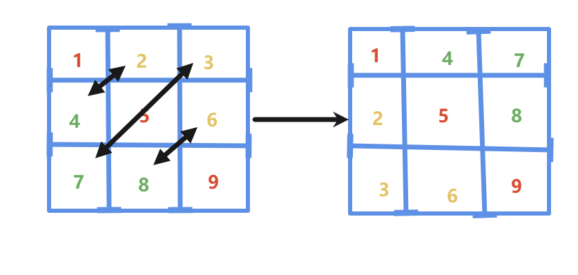

# 20. Rotate Image

- **题目 : [48. 旋转图像](https://leetcode.cn/problems/rotate-image/)**

> 难度: 中等
>
> 标签: 数组, 数学, 矩阵

## 解法一

**思路:**

- 首先我们需要知道**矩阵转置**的一个概念



如图所示

**红色的是主对角线元素**, 主对角线元素不变, 然后按照图示把对应**绿色和黄色的数字换位置**就是**矩阵转置**

- 此时我们可以发现, 只要对矩阵每一行再做一遍**翻转**便是答案了

**AC代码:**

```java
class Solution {
    public void rotate(int[][] matrix) {     
        int n = matrix.length;

        // 先对矩阵转置
        for(int i = 0; i < n; i++) {
            // 这里j从i开始遍历
            for(int j = i; j < n; j++) {
                // matrix[i][j] <--> matrix[j][i]
                int temp = matrix[i][j];
                matrix[i][j] = matrix[j][i];
                matrix[j][i] = temp;
            }
        }

        // 对矩阵的每行都进行翻转
        for(int i = 0; i < n; i++) {
            // 这里j从0开始遍历
            for(int j = 0; j < (n + 1) / 2; j++) {
                // matrix[i][j] <--> matrix[i][n - 1 - j]
                int temp = matrix[i][j];
                matrix[i][j] = matrix[i][n - 1 - j];
                matrix[i][n - 1 - j] = temp; 
            }
        }
    }
}
```

- **时间复杂度：O(n²)**

  转置和翻转各遍历矩阵约一半的元素，量级都是 n²。

- **空间复杂度：O(1)**

  都是原地交换，只用了常数个临时变量。

> 这道题是可以用数学公式推导出来的
>
> 但是那相对难推
>
> 正常刷题的话可以草稿纸上模拟, 然后大胆假设这就是规律
