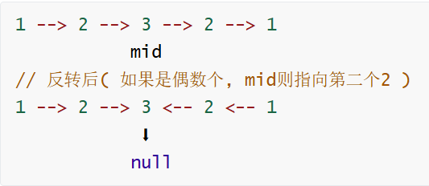

# 24. Palindrome Linked List

- **题目 : [234. 回文链表](https://leetcode.cn/problems/palindrome-linked-list/)**

> 难度: 简单
>
> 标签: 栈, 递归, 链表, 双指针

## 解法一

> 最显而易见的思路就是用栈了

**思路:**

- 用栈去存储val
- 先存一半链表, 然后判断总长度是否为奇数
- 如果是奇数, 跳过中间节点
- 如果不是, 正常开始判断后续节点便可

```java
class Solution {
    public boolean isPalindrome(ListNode head) {
        // 计算链表长度
        int len = 0;
        ListNode temp = head;
        while(temp != null) {
            len++;
            temp = temp.next;
        }
        // 用双端队列模拟栈
        Deque<Integer> stack = new ArrayDeque<>();
        
        // 遍历链表, 当长度为链表长度的一半时开始消去
        int mid = len >> 1;
        ListNode p = head;
        // 前一半入栈
        for(int i = 0; i < mid; i++){
            stack.push(p.val);
            p = p.next;
        }
        // 奇数长度，跳过中间那个节点
        if(len % 2 == 1){
            p = p.next;
        }
        // 后半段和栈对比   
        while(p != null){
            if(stack.pop() != p.val){
                return false;
            }
            p = p.next;
        }
        return true;
    }
}
```

- **时间复杂度：O(n)**

  先求一次长度，然后前一半压栈、后一半与栈顶逐个比较，总共两趟遍历。

- **空间复杂度：O(n)**

  栈里最多存放 n/2 个节点值。

---

## 解法二

**思路:**

- 先用快慢指针找到中间节点
- 然后把从中间节点开始的后段链表全部反转
- 反转后返回的是尾节点
- 然后分别遍历便可



```java
class Solution {
    public boolean isPalindrome(ListNode head) {
        ListNode mid = findMid(head);
        ListNode tail = reverse(mid);
        while(tail != null) {
            if(head.val != tail.val) return false;
            head = head.next;
            tail = tail.next;
        }
        return true;
    }
    // 用快慢双指针找到链表的中点
    // 如果是奇数个, slow指向中间
    // 如果是偶数个, slow指向右半部分左边界
    ListNode findMid(ListNode head) {
        ListNode slow = head;
        ListNode fast = head;

        while(fast != null && fast.next != null) {
            slow = slow.next;
            fast = fast.next.next;
        }
        return slow;
    }
    // 反转链表
    ListNode reverse(ListNode head) {
        if(head.next == null) return head;

        ListNode newhead = reverse(head.next);
        head.next.next = head;
        head.next = null;

        return newhead;
    }
}
```

- **时间复杂度：O(n)**

  找中点、反转后半段、比较，各一趟遍历。

- **空间复杂度：O(n)**

  这里的 `reverse` 是**递归**实现，递归深度 = 后半段长度，所以额外空间是 O(n)（把 `reverse` 改成迭代即可降到 O(1)）。

> 这里反转习惯性写成递归了, 所以没有空间为O(1)
>
> 把这里的递归改成迭代便可

## 解法三(把解法二递归换成迭代)

```java
class Solution {
    public boolean isPalindrome(ListNode head) {
        ListNode mid = findMid(head);
        ListNode tail = reverse(mid);
        while(tail != null) {
            if(head.val != tail.val) return false;
            head = head.next;
            tail = tail.next;
        }
        return true;
    }
    // 用快慢双指针找到链表的中点
    // 如果是奇数个, slow指向中间
    // 如果是偶数个, slow指向右半部分左边界
    ListNode findMid(ListNode head) {
        ListNode slow = head;
        ListNode fast = head;

        while(fast != null && fast.next != null) {
            slow = slow.next;
            fast = fast.next.next;
        }
        return slow;
    }
    // 反转链表
    ListNode reverse(ListNode head) {
        ListNode pre = null;
        ListNode cur = head;
        
        // 从头往后
        while(cur != null) {
            ListNode nxt = cur.next;

            cur.next = pre;
            pre = cur;
            cur = nxt;
        }
        return pre;
    }
}
```

